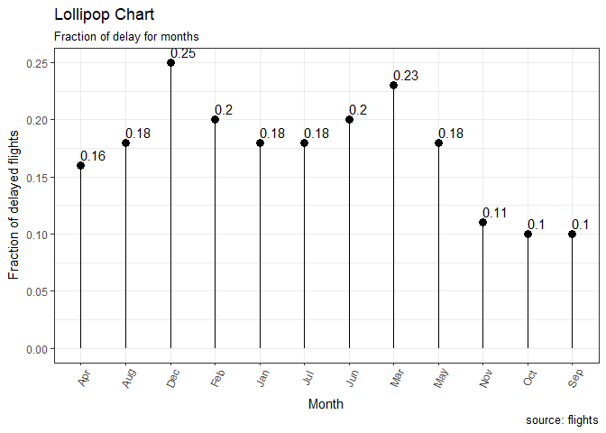
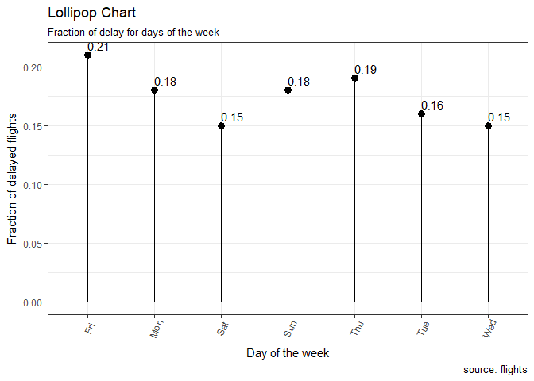
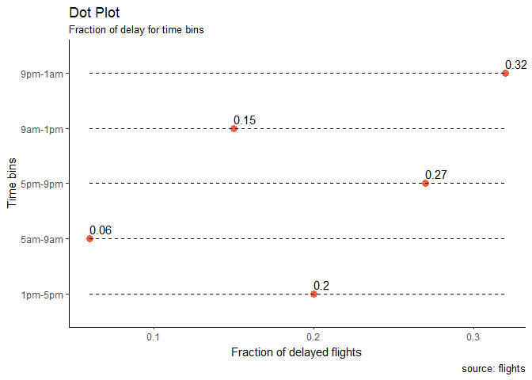
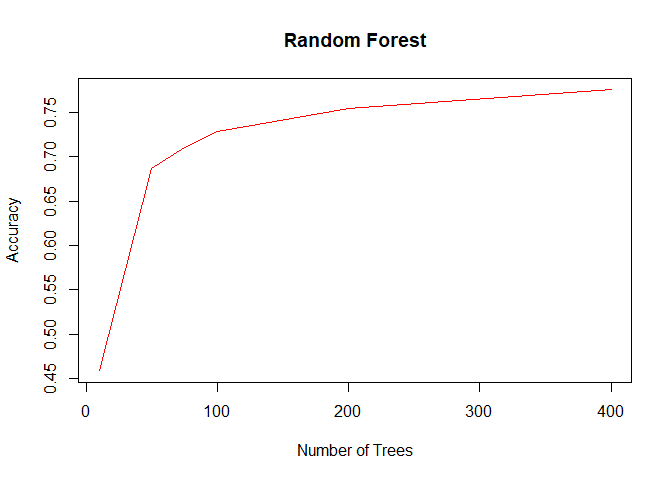
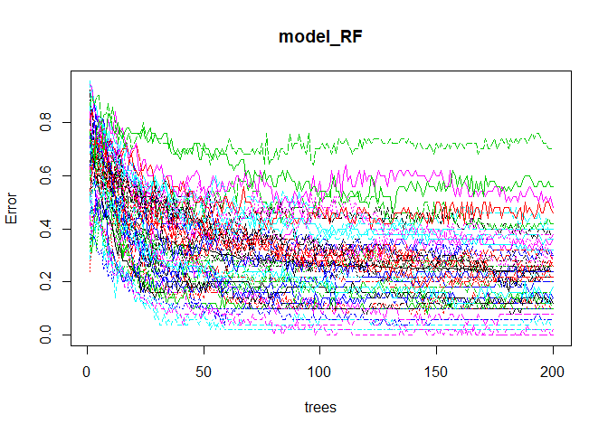
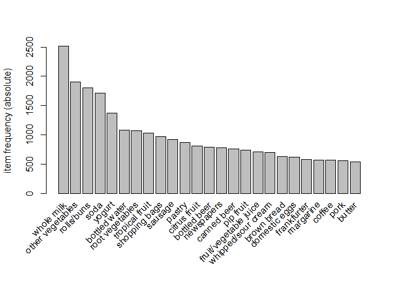
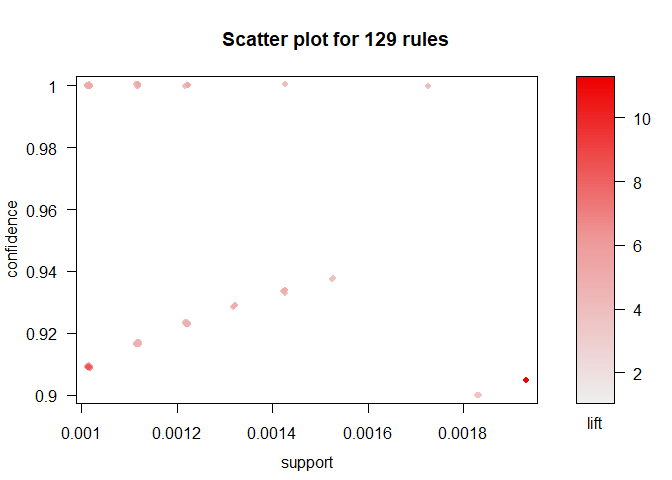
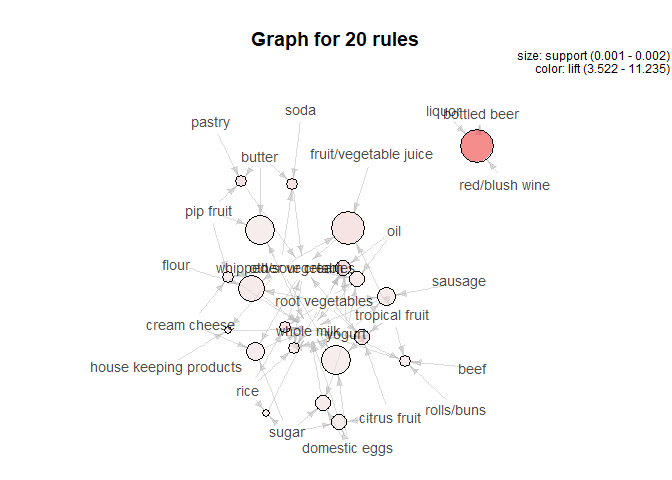
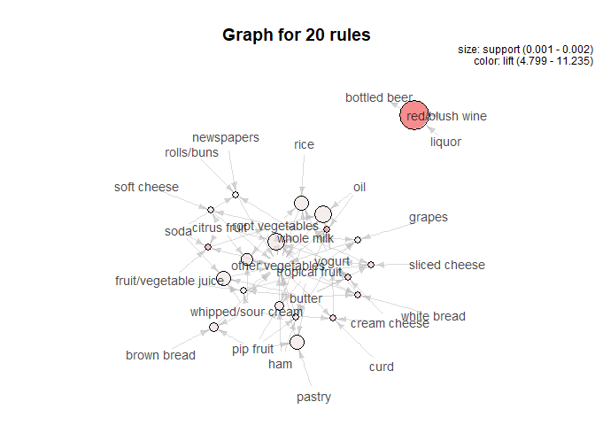

Assignment 2
================
Charvi Mittal,Monika Lodha, Ashwin baabu Paramasivan
August 18, 2017

Q1.Flights at ABIA
------------------

Consider the data in ABIA.csv, which contains information on every commercial flight in 2008 that either departed from or landed at Austin-Bergstrom Interational Airport. The variable codebook is as follows:

Year all 2008 Month 1-12 DayofMonth 1-31 DayOfWeek 1 (Monday) - 7 (Sunday) DepTime actual departure time (local, hhmm) CRSDepTime scheduled departure time (local, hhmm) ArrTime actual arrival time (local, hhmm) CRSArrTime scheduled arrival time (local, hhmm) UniqueCarrier unique carrier code FlightNum flight number TailNum plane tail number ActualElapsedTime in minutes CRSElapsedTime in minutes AirTime in minutes ArrDelay arrival delay, in minutes DepDelay departure delay, in minutes Origin origin IATA airport code Dest destination IATA airport code Distance in miles TaxiIn taxi in time, in minutes TaxiOut taxi out time in minutes Cancelled was the flight cancelled? CancellationCode reason for cancellation (A = carrier, B = weather, C = NAS, D = security) Diverted 1 = yes, 0 = no CarrierDelay in minutes WeatherDelay in minutes NASDelay in minutes SecurityDelay in minutes LateAircraftDelay in minutes Your task is to create a figure, or set of related figures, that tell an interesting story about flights into and out of Austin. You can annotate the figure and briefly describe it, but strive to make it as stand-alone as possible. It shouldn't need many, many paragraphs to convey its meaning. Rather, the figure should speak for itself as far as possible. For example, you might consider one of the following questions:

What is the best time of day to fly to minimize delays? What is the best time of year to fly to minimize delays? How do patterns of flights to different destinations or parts of the country change over the course of the year? What are the bad airports to fly to? But anything interesting will fly.

##### Reading data

``` r
library(data.table)
library(ggplot2)
```

    ## Warning: package 'ggplot2' was built under R version 3.3.3

``` r
Austin_flight = read.csv("ABIA.csv")
```

Let's find out the month with the highest fraction of delays
------------------------------------------------------------

``` r
#Replacing numerical month indicators to month names
Austin_flight$Month<-factor(Austin_flight$Month,levels=c(1,2,3,4,5,6,7,8,9,10,11,12),
            labels=c("Jan","Feb","Mar","Apr","May","Jun","Jul","Aug","Sep","Oct","Nov","Dec"))

#Selecting required columns and removing NA values
Austin_flight1<-Austin_flight[,c(2,16)]
Austin_flight1=Austin_flight1[which(!(is.na(Austin_flight1$DepDelay))),]

# According to FAA, a flight is considered delayed if it's delayed by more than 15 minutes.
Austin_flight1['Status']<-ifelse(Austin_flight1$DepDelay <= 15,'Undelayed','Delayed')

#Creating a dataframe with fraction of flight delays. Considering fraction because it might be the case that a particular month might have more number of total flights. Hence, number of delayed flights is not a fair measure.
Austin_flight2<-Austin_flight1[,c(1,3)]
set_m = table(Austin_flight2$Month,Austin_flight2$Status)
set_month<-as.data.frame.matrix(set_m)
set_month['fraction'] = set_month$Delayed/(set_month$Delayed+set_month$Undelayed)
setDT(set_month, keep.rownames = TRUE)[]
```

    ##      rn Delayed Undelayed  fraction
    ##  1: Jan    1562      7026 0.1818817
    ##  2: Feb    1613      6372 0.2020038
    ##  3: Mar    2039      6660 0.2343948
    ##  4: Apr    1363      6910 0.1647528
    ##  5: May    1620      7286 0.1818998
    ##  6: Jun    1836      7143 0.2044771
    ##  7: Jul    1562      7279 0.1766768
    ##  8: Aug    1516      6942 0.1792386
    ##  9: Sep     741      6569 0.1013680
    ## 10: Oct     802      6844 0.1048914
    ## 11: Nov     800      6198 0.1143184
    ## 12: Dec    1791      5373 0.2500000

``` r
set_month[,'fraction']=round(set_month[,'fraction'],2)

#Plotting fraction of flight delays against months
theme_set(theme_bw())
ggplot(set_month, aes(x=rn, y=fraction)) + 
  geom_point(size=3) + 
  geom_segment(aes(x=rn, 
                   xend=rn, 
                   y=0, 
                   yend=fraction)) + 
  labs(x = "Month") +
  labs(y = "Fraction of delayed flights") + 
  geom_text(aes(label=fraction),hjust=0, vjust=-0.5) +
  labs(title="Lollipop Chart", 
       subtitle="Fraction of delay for months", 
       caption="source: flights") + 
  theme(axis.text.x = element_text(angle=65, vjust=0.6))
```



### 25% of the flights in december gets delayed.

So which is the best month to travel to minimize delays?
--------------------------------------------------------

### The best month to travel is in the months of September, October and November.

#### The worst month to travel is March and December which makes sense because December includes travel for the holidays and March includes travel for Spring Break. These time periods typically see an influx of travellers, which could be a factor contributing to an increase in fraction of flight delays.

Next let's see the pattern of delay in a week
---------------------------------------------

``` r
#Replacing numerical day indicators to day names
Austin_flight$DayOfWeek<-factor(Austin_flight$DayOfWeek,levels=c(1,2,3,4,5,6,7),
                                labels=c("Mon","Tue","Wed","Thu","Fri","Sat","Sun"))

#Selecting required columns and removing NA values
Austin_flight1<-Austin_flight[,c(4,16)]
Austin_flight1=Austin_flight1[which(!(is.na(Austin_flight1$DepDelay))),]

# According to FAA, a flight is considered delayed if it's delayed by more than 15 minutes.
Austin_flight1['Status']<-ifelse(Austin_flight1$DepDelay <= 15,'Undelayed','Delayed')

#Creating a dataframe with fraction of flight delays. Considering fraction because it might be the case that a particular month might have more number of total flights. Hence, number of delayed flights is not a fair measure.
Austin_flight2<-Austin_flight1[,c(1,3)]
set_m = table(Austin_flight2$DayOfWeek,Austin_flight2$Status)
set_day<-as.data.frame.matrix(set_m)
set_day['fraction'] = set_day$Delayed/(set_day$Delayed+set_day$Undelayed)
setDT(set_day, keep.rownames = TRUE)[]
```

    ##     rn Delayed Undelayed  fraction
    ## 1: Mon    2587     12029 0.1769978
    ## 2: Tue    2371     12143 0.1633595
    ## 3: Wed    2246     12372 0.1536462
    ## 4: Thu    2751     11806 0.1889812
    ## 5: Fri    3041     11530 0.2087022
    ## 6: Sat    1733      9571 0.1533086
    ## 7: Sun    2516     11151 0.1840931

``` r
set_day[,'fraction']=round(set_day[,'fraction'],2)

#Plotting fraction of flight delays against days of the week
theme_set(theme_bw())
ggplot(set_day, aes(x=rn, y=fraction)) + 
  geom_point(size=3) + 
  geom_segment(aes(x=rn, 
                   xend=rn, 
                   y=0, 
                   yend=fraction)) + 
  labs(x = "Day of the week") +
  labs(y = "Fraction of delayed flights") + 
  geom_text(aes(label=fraction),hjust=0, vjust=-0.5) +
  labs(title="Lollipop Chart", 
       subtitle="Fraction of delay for days of the week", 
       caption="source: flights") + 
  theme(axis.text.x = element_text(angle=65, vjust=0.6))
```



### 21% of the flights gets delayed on a Friday

So which is the best day to travel to minimize delays?
------------------------------------------------------

### The best day to travel is Wednesday and Saturday.

Finally let's find out the busiest time of the day
--------------------------------------------------

``` r
#Selecting necessary columns
Austin_flight1<-Austin_flight[,c(6,16)]
#Removing NA values
Austin_flight1=Austin_flight1[which(!(is.na(Austin_flight1$DepDelay))),]
#Putting all departure times into bins
Austin_flight1['Departure_time']<-ifelse(Austin_flight1$CRSDepTime > 100 & Austin_flight1$CRSDepTime <= 500,'1am-5am',
                                  ifelse(Austin_flight1$CRSDepTime > 500 & Austin_flight1$CRSDepTime <= 900,'5am-9am',
                                  ifelse(Austin_flight1$CRSDepTime > 900 & Austin_flight1$CRSDepTime <= 1300,'9am-1pm',
                                  ifelse(Austin_flight1$CRSDepTime > 1300 & Austin_flight1$CRSDepTime <= 1700,'1pm-5pm',
                                  ifelse(Austin_flight1$CRSDepTime > 1700 & Austin_flight1$CRSDepTime <= 2100,'5pm-9pm','9pm-1am')))))

# According to FAA, a flight is considered delayed if it's delayed by more than 15 minutes

Austin_flight1['Status']<-ifelse(Austin_flight1$DepDelay <= 15,'Undelayed','Delayed')

#Creating a dataframe with fraction of flight delays. Considering fraction because it might be the case that a particular time bin might have more number of total flights. Hence, number of delayed flights is not a fair measure.

Austin_flight2<-Austin_flight1[,c(3,4)]
set_a = table(Austin_flight2$Departure_time,Austin_flight2$Status)
set_time<-as.data.frame.matrix(set_a)
View(set_a)
set_time['fraction'] = set_time$Delayed/(set_time$Delayed+set_time$Undelayed)
setDT(set_time, keep.rownames = TRUE)[]
```

    ##         rn Delayed Undelayed   fraction
    ## 1: 1pm-5pm    5199     20294 0.20393834
    ## 2: 5am-9am    1459     21918 0.06241177
    ## 3: 5pm-9pm    6205     16820 0.26948969
    ## 4: 9am-1pm    3513     19720 0.15120733
    ## 5: 9pm-1am     869      1850 0.31960280

``` r
set_time[,'fraction']=round(set_time[,'fraction'],2)
View(set_time)

#Plotting fraction of flight delays against time bins
library(ggplot2)
library(scales)
```

    ## Warning: package 'scales' was built under R version 3.3.3

``` r
theme_set(theme_classic())

ggplot(set_time, aes(x=rn,y=fraction))+ 
  geom_point(col="tomato2", size=3) +   
  # Draw points
  geom_segment(aes(x=rn, 
                   xend=rn,
                   y=min(fraction), 
                   yend=max(fraction)), 
               linetype="dashed", 
               size=0.1)+   
  labs(x = "Time bins") +
  labs(y = "Fraction of delayed flights") + 
  geom_text(aes(label=fraction),hjust=0, vjust=-0.5) +
  # Draw dashed lines
  labs(title="Dot Plot", 
       subtitle="Fraction of delay for time bins", 
       caption="source: flights") +  
  coord_flip()
```



### We see that 32% of flights get delayed if they are departing from Austin between 9pm and 1am.

So what is the best time to travel in a day to minimize delays?
---------------------------------------------------------------

### The best time to travel is between 5am and 9am.

#### These fractions include only the departure delay times from the dataset due to several reasons. Because the other delay variables (Weather, Security, etc. ) had a very large number of missing values and hence they were excluded from the delay computations in order to use as much of the dataset as possible. For example, the Security Delay variable or WeatherDelay had 79,513 NA values (80% of the total dataset) so including it would not significantly affect delay time.

Q2.Author attribution
---------------------

Revisit the Reuters C50 corpus that we explored in class. Your task is to build two separate models (using any combination of tools you see fit) for predicting the author of an article on the basis of that article's textual content. Describe clearly what models you are using, how you constructed features, and so forth. (Yes, this is a supervised learning task, but it potentially draws on a lot of what you know about unsupervised learning!)

In the C50train directory, you have ~50 articles from each of 50 different authors (one author per directory). Use this training data (and this data alone) to build the two models. Then apply your model to the articles by the same authors in the C50test directory, which is about the same size as the training set. How well do your models do at predicting the author identities in this out-of-sample setting? Are there any sets of authors whose articles seem difficult to distinguish from one another? Which model do you prefer?

Note: you will need to figure out a way to deal with words in the test set that you never saw in the training set. This is a nontrivial aspect of the modeling exercise.

#### Library Load

``` r
library(tm) 
```

    ## Warning: package 'tm' was built under R version 3.3.3

    ## Loading required package: NLP

    ## Warning: package 'NLP' was built under R version 3.3.3

    ## 
    ## Attaching package: 'NLP'

    ## The following object is masked from 'package:ggplot2':
    ## 
    ##     annotate

``` r
library(magrittr)
library(e1071)
```

    ## Warning: package 'e1071' was built under R version 3.3.3

``` r
library(caret)
```

    ## Warning: package 'caret' was built under R version 3.3.3

    ## Loading required package: lattice

``` r
library(dplyr)
```

    ## Warning: package 'dplyr' was built under R version 3.3.3

    ## 
    ## Attaching package: 'dplyr'

    ## The following objects are masked from 'package:data.table':
    ## 
    ##     between, first, last

    ## The following objects are masked from 'package:stats':
    ## 
    ##     filter, lag

    ## The following objects are masked from 'package:base':
    ## 
    ##     intersect, setdiff, setequal, union

``` r
library(doParallel)
```

    ## Warning: package 'doParallel' was built under R version 3.3.3

    ## Loading required package: foreach

    ## Warning: package 'foreach' was built under R version 3.3.3

    ## Loading required package: iterators

    ## Warning: package 'iterators' was built under R version 3.3.3

    ## Loading required package: parallel

``` r
library(foreach)
library(randomForest)
```

    ## Warning: package 'randomForest' was built under R version 3.3.3

    ## randomForest 4.6-12

    ## Type rfNews() to see new features/changes/bug fixes.

    ## 
    ## Attaching package: 'randomForest'

    ## The following object is masked from 'package:dplyr':
    ## 
    ##     combine

    ## The following object is masked from 'package:ggplot2':
    ## 
    ##     margin

``` r
library(plyr)
```

    ## Warning: package 'plyr' was built under R version 3.3.3

    ## -------------------------------------------------------------------------

    ## You have loaded plyr after dplyr - this is likely to cause problems.
    ## If you need functions from both plyr and dplyr, please load plyr first, then dplyr:
    ## library(plyr); library(dplyr)

    ## -------------------------------------------------------------------------

    ## 
    ## Attaching package: 'plyr'

    ## The following objects are masked from 'package:dplyr':
    ## 
    ##     arrange, count, desc, failwith, id, mutate, rename, summarise,
    ##     summarize

``` r
readerPlain = function(fname){
  readPlain(elem=list(content=readLines(fname)), 
            id=fname, language='en') }
```

############ TRAIN DATASET

``` r
author_dirs = Sys.glob('ReutersC50/C50train/*')
```

#### Extract authors, file names

``` r
file_list = NULL
train_labels = NULL
for(author in author_dirs) {
  author_name = substring(author, first=21)
  files_to_add = Sys.glob(paste0(author, '/*.txt'))
  file_list = append(file_list, files_to_add)
  train_labels = append(train_labels, rep(author_name, length(files_to_add)))
}

all_docs = lapply(file_list, readerPlain)

mynames = file_list %>%
{ strsplit(., '/', fixed=TRUE) } %>%
{ lapply(., tail, n=2) } %>%
{ lapply(., paste0, collapse = '') } %>%
  unlist

names(all_docs) = mynames
names(all_docs) = sub('.txt', '', names(all_docs))
```

### Create a corpus

``` r
train_Corpus = Corpus(VectorSource(all_docs))
```

Preprocessing
=============

``` r
train_Corpus = tm_map(train_Corpus, content_transformer(tolower)) # make everything lowercase
train_Corpus = tm_map(train_Corpus, content_transformer(removeNumbers)) # remove numbers
train_Corpus = tm_map(train_Corpus, content_transformer(removePunctuation)) # remove punctuation
train_Corpus = tm_map(train_Corpus, content_transformer(stripWhitespace)) ## remove excess white-space
train_Corpus = tm_map(train_Corpus, content_transformer(removeWords), stopwords("SMART"))
```

### Create document term matrix

``` r
DTM_train = DocumentTermMatrix(train_Corpus,control=list(weighting=weightTfIdf, bounds = list(global = c(5, Inf))))
```

#### Keep terms which appear in 95% or more documents

``` r
DTM_train = removeSparseTerms(DTM_train, 0.95)
DTM_train
```

    ## <<DocumentTermMatrix (documents: 2500, terms: 644)>>
    ## Non-/sparse entries: 184397/1425603
    ## Sparsity           : 89%
    ## Maximal term length: 18
    ## Weighting          : term frequency - inverse document frequency (normalized) (tf-idf)

``` r
DTM_train = as.matrix(DTM_train)
DTM_train = as.data.frame(DTM_train)
```

#### TEST Dataset

### Repeat steps as above to get document matrix for test dataset

``` r
author_dirs = Sys.glob('ReutersC50/C50test/*')

file_list = NULL
test_labels = NULL
author_names = NULL
for(author in author_dirs) {
  author_name = substring(author, first=20)
  author_names = append(author_names, author_name)
  files_to_add = Sys.glob(paste0(author, '/*.txt'))
  file_list = append(file_list, files_to_add)
  test_labels = append(test_labels, rep(author_name, length(files_to_add)))
}

all_docs = lapply(file_list, readerPlain) 
names(all_docs) = file_list
names(all_docs) = sub('.txt', '', names(all_docs))
```

### test corpus

``` r
test_corpus = Corpus(VectorSource(all_docs))

test_corpus = tm_map(test_corpus, content_transformer(tolower))
test_corpus = tm_map(test_corpus, content_transformer(removeNumbers))
test_corpus = tm_map(test_corpus, content_transformer(removePunctuation))
test_corpus = tm_map(test_corpus, content_transformer(stripWhitespace))
test_corpus = tm_map(test_corpus, content_transformer(removeWords), stopwords("en"))

DTM_test = DocumentTermMatrix(test_corpus, control=list(weighting=weightTfIdf, bounds = list(global = c(5, Inf))))
DTM_test = removeSparseTerms(DTM_test, 0.95)
DTM_test
```

    ## <<DocumentTermMatrix (documents: 2500, terms: 800)>>
    ## Non-/sparse entries: 245048/1754952
    ## Sparsity           : 88%
    ## Maximal term length: 18
    ## Weighting          : term frequency - inverse document frequency (normalized) (tf-idf)

``` r
DTM_test = as.matrix(DTM_test)
DTM_test = as.data.frame(DTM_test)
```

#### Model building for Naive Bayes

### Consider all features and append corresponding author names for each document

``` r
DTM_train<-cbind(DTM_train,train_labels)
DTM_test<-cbind(DTM_test,test_labels)

nB = naiveBayes(as.factor(train_labels)~., data=DTM_train)
nB_predictions = predict(nB, DTM_test[,-ncol(DTM_test)], type="class")
```

#### Comparison of predictions and actual authors

``` r
nB_table <-data.frame(table(DTM_test$test_labels, nB_predictions))

sum(DTM_test$test_labels == nB_predictions)
```

    ## [1] 1005

### Around 1000 authors matched out of a total 2500 author-document combinations

``` r
nB_table %>% filter(Var1 == nB_predictions) %>% arrange(desc(Freq)) %>% filter(Freq >= 25)
```

    ## Warning: package 'bindrcpp' was built under R version 3.3.3

    ##               Var1  nB_predictions Freq
    ## 1  LynnleyBrowning LynnleyBrowning   38
    ## 2     MatthewBunce    MatthewBunce   37
    ## 3   FumikoFujisaki  FumikoFujisaki   36
    ## 4   LynneO'Donnell  LynneO'Donnell   33
    ## 5        LydiaZajc       LydiaZajc   31
    ## 6   JoWinterbottom  JoWinterbottom   30
    ## 7    AaronPressman   AaronPressman   29
    ## 8   GrahamEarnshaw  GrahamEarnshaw   29
    ## 9    PeterHumphrey   PeterHumphrey   29
    ## 10     BradDorfman     BradDorfman   28
    ## 11    JimGilchrist    JimGilchrist   28
    ## 12      RobinSidel      RobinSidel   28
    ## 13  AlexanderSmith  AlexanderSmith   27
    ## 14   KirstinRidley   KirstinRidley   27
    ## 15       NickLouth       NickLouth   25

### Most matched author is LynnleyBrowning with match of 38

#### \#\#\#\# check for DavidLawder with 4 matches. Which author did he mostly match with?

``` r
nB_table %>% filter(Var1 == 'DavidLawder') %>% filter(Freq >0)
```

    ##           Var1  nB_predictions Freq
    ## 1  DavidLawder     BradDorfman    5
    ## 2  DavidLawder     DavidLawder    4
    ## 3  DavidLawder   JaneMacartney    1
    ## 4  DavidLawder        JoeOrtiz    1
    ## 5  DavidLawder     KarlPenhaul    1
    ## 6  DavidLawder  KevinDrawbaugh    3
    ## 7  DavidLawder   KevinMorrison    2
    ## 8  DavidLawder       LydiaZajc    1
    ## 9  DavidLawder    MarkBendeich    1
    ## 10 DavidLawder      MartinWolk    2
    ## 11 DavidLawder       NickLouth    2
    ## 12 DavidLawder PatriciaCommins    5
    ## 13 DavidLawder      RobinSidel    1
    ## 14 DavidLawder  TheresePoletti    3
    ## 15 DavidLawder      TimFarrand    1
    ## 16 DavidLawder      ToddNissen   17

### His writing style matched with ToddNissen

#### Let's check for authors with same writing style and hence tough to figure the author attribution

``` r
nB_table %>% filter(Var1 != nB_predictions) %>% filter(Freq >10) %>% arrange(desc(Freq))
```

    ##               Var1 nB_predictions Freq
    ## 1      DavidLawder     ToddNissen   17
    ## 2      SimonCowell AlexanderSmith   16
    ## 3         TanEeLyn  PeterHumphrey   16
    ## 4   AlexanderSmith       JoeOrtiz   15
    ## 5    JaneMacartney    ScottHillis   14
    ## 6      ScottHillis  PeterHumphrey   13
    ## 7       MureDickie    ScottHillis   12
    ## 8      SamuelPerry TheresePoletti   12
    ## 9       AlanCrosby   JohnMastrini   11
    ## 10 PatriciaCommins KevinDrawbaugh   11

#### How accurate was this model?

``` r
confusionMatrix(DTM_test$test_labels, nB_predictions)$overall['Accuracy']
```

    ## Accuracy 
    ##    0.402

##### Accuracy of 40% with naive bayes

##### Model building for Random Forests

``` r
set.seed(100)

registerDoParallel(cores = 6)
testTrees = c(10,50,75,100,200,400)
TreeClass = foreach( i = 1:length(testTrees),.combine = 'c') %dopar%
{
  model_RF = randomForest::randomForest(x=DTM_train[,-ncol(DTM_train)], y=as.factor(train_labels),ntree = testTrees[i])
  pred_RF = predict(model_RF, data=DTM_test[,-ncol(DTM_test)])
  caret::confusionMatrix(DTM_test$test_labels, pred_RF)$overall['Accuracy']
}
```

``` r
plot(testTrees,TreeClass,type = "l", col = "red",main = "Random Forest",xlab = "Number of Trees",ylab = "Accuracy")
```



### Doubling trees from 200 to 400 increases accuracy only by about 3-4%

### hence we consider tree size of 200 so that model is too complex

#### Random Forest with trees as 200

``` r
model_RF = randomForest(x=DTM_train[,-ncol(DTM_train)], y=as.factor(train_labels), ntree=200)
plot(model_RF)
```



``` r
pred_RF = predict(model_RF, data=DTM_test[,-ncol(DTM_test)])
```

### Comparison of actual and predicted values

``` r
RF_table <-data.frame(table(DTM_test$test_labels, pred_RF))
```

``` r
sum(DTM_test$test_labels == pred_RF)
```

    ## [1] 1906

### There was a match of 1906 author-document which is pretty high when compared with Naive Bayes

``` r
RF_match<-data.frame(DTM_test$test_labels[which(DTM_test$test_labels == pred_RF)])
```

#### Top matched authors

``` r
count(RF_match,RF_match$Labels)[1:10,1:2]
```

    ##    DTM_test.test_labels.which.DTM_test.test_labels....pred_RF.. freq
    ## 1                                                 AaronPressman   45
    ## 2                                                    AlanCrosby   40
    ## 3                                                AlexanderSmith   35
    ## 4                                               BenjaminKangLim   30
    ## 5                                                 BernardHickey   32
    ## 6                                                   BradDorfman   31
    ## 7                                              DarrenSchuettler   45
    ## 8                                                   DavidLawder   44
    ## 9                                                 EdnaFernandes   35
    ## 10                                                  EricAuchard   34

#### check for William Kazer with 22 matches. Which author did he mostly match with?

``` r
RF_table %>% filter(Var1 == 'WilliamKazer') %>% filter(Freq >0)
```

    ##            Var1         pred_RF Freq
    ## 1  WilliamKazer BenjaminKangLim    5
    ## 2  WilliamKazer  GrahamEarnshaw    3
    ## 3  WilliamKazer   JaneMacartney    2
    ## 4  WilliamKazer    JimGilchrist    1
    ## 5  WilliamKazer  LynneO'Donnell    1
    ## 6  WilliamKazer      MureDickie    6
    ## 7  WilliamKazer   PeterHumphrey    1
    ## 8  WilliamKazer    SarahDavison    3
    ## 9  WilliamKazer     ScottHillis    4
    ## 10 WilliamKazer        TanEeLyn    2
    ## 11 WilliamKazer    WilliamKazer   22

#### william Kazer matched with Mure Dickie and Benjamin KangLim 6 and 5 times repectively

### This number is quite low. This shows Random Forest is a good model for predicting author attributions

#### Let's check for authors with same writing style and hence tough to figure the author attribution

``` r
RF_table %>% filter(Var1 != pred_RF) %>% filter(Freq >5) %>% arrange(desc(Freq))
```

    ##               Var1         pred_RF Freq
    ## 1      ScottHillis BenjaminKangLim   11
    ## 2     JohnMastrini      JanLopatka   11
    ## 3       ToddNissen     DavidLawder    9
    ## 4         TanEeLyn   PeterHumphrey    9
    ## 5       PierreTran MarcelMichelson    8
    ## 6    JaneMacartney BenjaminKangLim    7
    ## 7       MureDickie BenjaminKangLim    7
    ## 8   KevinDrawbaugh     BradDorfman    6
    ## 9       JanLopatka    JohnMastrini    6
    ## 10   EdnaFernandes  JoWinterbottom    6
    ## 11   KirstinRidley  JoWinterbottom    6
    ## 12    MarkBendeich   KevinMorrison    6
    ## 13 BenjaminKangLim      MureDickie    6
    ## 14    WilliamKazer      MureDickie    6
    ## 15     BradDorfman PatriciaCommins    6
    ## 16 BenjaminKangLim     ScottHillis    6
    ## 17   JaneMacartney     ScottHillis    6
    ## 18   PeterHumphrey        TanEeLyn    6
    ## 19    SarahDavison        TanEeLyn    6
    ## 20     SamuelPerry  TheresePoletti    6

#### Accuracy of Random Forest

``` r
confusionMatrix(DTM_test$test_labels, pred_RF)$overall['Accuracy']
```

    ## Accuracy 
    ##   0.7624

#### Accuracy of 76% with Random Forests

### Random Forest performs better in this scenario with an accuracy of 76% over an accuracy of 40%

### associated with Naive Bayes.

### Naive Bayes had author match of around 1000 with most matched author being Lynnley Browning

### with a match of 38. Most mismatched author was David Lawder with just 4 matches. his writing style

### mostly matched with Todd Nissen

### Random Forests has author match of 1906 with Aaron Pressman being highest match of 45.

### Most mismatched author was William Kazer with 22 match and he had 5 and 6 matches with Benjamin

### Kanglim and Mure Dickie

### This shows how Random Forests has improved.

### also the highest match in with Naive Bayes 'Lynnley Browing' now has a match of 46

Q3. Practice with association rule mining
-----------------------------------------

Revisit the notes on association rule mining, and walk through the R example on music playlists: playlists.R and playlists.csv. Then use the data on grocery purchases in groceries.txt and find some interesting association rules for these shopping baskets. The data file is a list of baskets: one row per basket, with multiple items per row separated by commas -- you'll have to cobble together a few utilities for processing this into the format expected by the "arules" package. Pick your own thresholds for lift and confidence; just be clear what these thresholds are and how you picked them. Do your discovered item sets make sense? Present your discoveries in an interesting and concise way.

``` r
library(arules)
```

    ## Warning: package 'arules' was built under R version 3.3.3

    ## Loading required package: Matrix

    ## 
    ## Attaching package: 'arules'

    ## The following object is masked from 'package:dplyr':
    ## 
    ##     recode

    ## The following object is masked from 'package:tm':
    ## 
    ##     inspect

    ## The following objects are masked from 'package:base':
    ## 
    ##     abbreviate, write

``` r
library(arulesViz)
```

    ## Warning: package 'arulesViz' was built under R version 3.3.3

    ## Loading required package: grid

``` r
groceries <- read.transactions(file="groceries.txt",sep = ',',format="basket",rm.duplicates=TRUE)
summary(groceries)
```

    ## transactions as itemMatrix in sparse format with
    ##  9835 rows (elements/itemsets/transactions) and
    ##  169 columns (items) and a density of 0.02609146 
    ## 
    ## most frequent items:
    ##       whole milk other vegetables       rolls/buns             soda 
    ##             2513             1903             1809             1715 
    ##           yogurt          (Other) 
    ##             1372            34055 
    ## 
    ## element (itemset/transaction) length distribution:
    ## sizes
    ##    1    2    3    4    5    6    7    8    9   10   11   12   13   14   15 
    ## 2159 1643 1299 1005  855  645  545  438  350  246  182  117   78   77   55 
    ##   16   17   18   19   20   21   22   23   24   26   27   28   29   32 
    ##   46   29   14   14    9   11    4    6    1    1    1    1    3    1 
    ## 
    ##    Min. 1st Qu.  Median    Mean 3rd Qu.    Max. 
    ##   1.000   2.000   3.000   4.409   6.000  32.000 
    ## 
    ## includes extended item information - examples:
    ##             labels
    ## 1 abrasive cleaner
    ## 2 artif. sweetener
    ## 3   baby cosmetics

``` r
itemFrequencyPlot(groceries, topN=25, type='absolute')
```



#### As seen from the plot the frequency of occurence of certain items(WHole milk, other vegetables, rolls/buns, soda and yogurt) have frequency of occurences more than 1000, hecne it also means that they could possibly play an important role in the rule mapping.

``` r
grocrules <- apriori(groceries, 
                      parameter=list(support=.001, confidence=0.90, maxlen=40))
```

    ## Apriori
    ## 
    ## Parameter specification:
    ##  confidence minval smax arem  aval originalSupport maxtime support minlen
    ##         0.9    0.1    1 none FALSE            TRUE       5   0.001      1
    ##  maxlen target   ext
    ##      40  rules FALSE
    ## 
    ## Algorithmic control:
    ##  filter tree heap memopt load sort verbose
    ##     0.1 TRUE TRUE  FALSE TRUE    2    TRUE
    ## 
    ## Absolute minimum support count: 9 
    ## 
    ## set item appearances ...[0 item(s)] done [0.00s].
    ## set transactions ...[169 item(s), 9835 transaction(s)] done [0.00s].
    ## sorting and recoding items ... [157 item(s)] done [0.00s].
    ## creating transaction tree ... done [0.00s].
    ## checking subsets of size 1 2 3 4 5 6 done [0.01s].
    ## writing ... [129 rule(s)] done [0.00s].
    ## creating S4 object  ... done [0.00s].

``` r
inspect(grocrules)
```

    ##       lhs                           rhs                    support confidence      lift
    ## [1]   {liquor,                                                                         
    ##        red/blush wine}           => {bottled beer}     0.001931876  0.9047619 11.235269
    ## [2]   {cereals,                                                                        
    ##        curd}                     => {whole milk}       0.001016777  0.9090909  3.557863
    ## [3]   {bottled beer,                                                                   
    ##        soups}                    => {whole milk}       0.001118454  0.9166667  3.587512
    ## [4]   {house keeping products,                                                         
    ##        whipped/sour cream}       => {whole milk}       0.001220132  0.9230769  3.612599
    ## [5]   {pastry,                                                                         
    ##        sweet spreads}            => {whole milk}       0.001016777  0.9090909  3.557863
    ## [6]   {rice,                                                                           
    ##        sugar}                    => {whole milk}       0.001220132  1.0000000  3.913649
    ## [7]   {bottled water,                                                                  
    ##        rice}                     => {whole milk}       0.001220132  0.9230769  3.612599
    ## [8]   {canned fish,                                                                    
    ##        hygiene articles}         => {whole milk}       0.001118454  1.0000000  3.913649
    ## [9]   {grapes,                                                                         
    ##        onions}                   => {other vegetables} 0.001118454  0.9166667  4.737476
    ## [10]  {hard cheese,                                                                    
    ##        oil}                      => {other vegetables} 0.001118454  0.9166667  4.737476
    ## [11]  {butter,                                                                         
    ##        rice,                                                                           
    ##        root vegetables}          => {whole milk}       0.001016777  1.0000000  3.913649
    ## [12]  {fruit/vegetable juice,                                                          
    ##        herbs,                                                                          
    ##        whole milk}               => {other vegetables} 0.001016777  0.9090909  4.698323
    ## [13]  {citrus fruit,                                                                   
    ##        herbs,                                                                          
    ##        tropical fruit}           => {whole milk}       0.001118454  0.9166667  3.587512
    ## [14]  {flour,                                                                          
    ##        root vegetables,                                                                
    ##        whipped/sour cream}       => {whole milk}       0.001728521  1.0000000  3.913649
    ## [15]  {butter,                                                                         
    ##        domestic eggs,                                                                  
    ##        soft cheese}              => {whole milk}       0.001016777  1.0000000  3.913649
    ## [16]  {soft cheese,                                                                    
    ##        tropical fruit,                                                                 
    ##        whipped/sour cream}       => {other vegetables} 0.001220132  0.9230769  4.770605
    ## [17]  {root vegetables,                                                                
    ##        soft cheese,                                                                    
    ##        whipped/sour cream}       => {whole milk}       0.001220132  0.9230769  3.612599
    ## [18]  {citrus fruit,                                                                   
    ##        root vegetables,                                                                
    ##        soft cheese}              => {other vegetables} 0.001016777  1.0000000  5.168156
    ## [19]  {frankfurter,                                                                    
    ##        frozen meals,                                                                   
    ##        tropical fruit}           => {other vegetables} 0.001016777  0.9090909  4.698323
    ## [20]  {frankfurter,                                                                    
    ##        frozen meals,                                                                   
    ##        tropical fruit}           => {whole milk}       0.001016777  0.9090909  3.557863
    ## [21]  {butter,                                                                         
    ##        frozen meals,                                                                   
    ##        tropical fruit}           => {whole milk}       0.001016777  0.9090909  3.557863
    ## [22]  {hard cheese,                                                                    
    ##        tropical fruit,                                                                 
    ##        whipped/sour cream}       => {other vegetables} 0.001016777  0.9090909  4.698323
    ## [23]  {butter milk,                                                                    
    ##        pork,                                                                           
    ##        whole milk}               => {other vegetables} 0.001016777  0.9090909  4.698323
    ## [24]  {butter milk,                                                                    
    ##        fruit/vegetable juice,                                                          
    ##        pip fruit}                => {other vegetables} 0.001016777  0.9090909  4.698323
    ## [25]  {frankfurter,                                                                    
    ##        root vegetables,                                                                
    ##        sliced cheese}            => {whole milk}       0.001016777  0.9090909  3.557863
    ## [26]  {butter,                                                                         
    ##        sliced cheese,                                                                  
    ##        whipped/sour cream}       => {whole milk}       0.001220132  0.9230769  3.612599
    ## [27]  {coffee,                                                                         
    ##        oil,                                                                            
    ##        yogurt}                   => {other vegetables} 0.001016777  0.9090909  4.698323
    ## [28]  {napkins,                                                                        
    ##        onions,                                                                         
    ##        root vegetables}          => {other vegetables} 0.001016777  0.9090909  4.698323
    ## [29]  {berries,                                                                        
    ##        butter,                                                                         
    ##        sausage}                  => {whole milk}       0.001016777  0.9090909  3.557863
    ## [30]  {hamburger meat,                                                                 
    ##        tropical fruit,                                                                 
    ##        whipped/sour cream}       => {other vegetables} 0.001016777  0.9090909  4.698323
    ## [31]  {butter,                                                                         
    ##        hygiene articles,                                                               
    ##        napkins}                  => {whole milk}       0.001016777  0.9090909  3.557863
    ## [32]  {butter,                                                                         
    ##        hygiene articles,                                                               
    ##        pip fruit}                => {whole milk}       0.001016777  1.0000000  3.913649
    ## [33]  {butter,                                                                         
    ##        hygiene articles,                                                               
    ##        tropical fruit}           => {whole milk}       0.001220132  0.9230769  3.612599
    ## [34]  {domestic eggs,                                                                  
    ##        hygiene articles,                                                               
    ##        tropical fruit}           => {whole milk}       0.001220132  0.9230769  3.612599
    ## [35]  {hygiene articles,                                                               
    ##        root vegetables,                                                                
    ##        whipped/sour cream}       => {whole milk}       0.001016777  1.0000000  3.913649
    ## [36]  {hygiene articles,                                                               
    ##        pip fruit,                                                                      
    ##        root vegetables}          => {whole milk}       0.001016777  1.0000000  3.913649
    ## [37]  {cream cheese,                                                                   
    ##        domestic eggs,                                                                  
    ##        sugar}                    => {whole milk}       0.001118454  1.0000000  3.913649
    ## [38]  {cream cheese,                                                                   
    ##        other vegetables,                                                               
    ##        sugar}                    => {whole milk}       0.001525165  0.9375000  3.669046
    ## [39]  {curd,                                                                           
    ##        domestic eggs,                                                                  
    ##        sugar}                    => {whole milk}       0.001016777  1.0000000  3.913649
    ## [40]  {citrus fruit,                                                                   
    ##        domestic eggs,                                                                  
    ##        sugar}                    => {whole milk}       0.001423488  0.9333333  3.652739
    ## [41]  {domestic eggs,                                                                  
    ##        sugar,                                                                          
    ##        tropical fruit}           => {whole milk}       0.001118454  0.9166667  3.587512
    ## [42]  {domestic eggs,                                                                  
    ##        sugar,                                                                          
    ##        yogurt}                   => {whole milk}       0.001423488  0.9333333  3.652739
    ## [43]  {root vegetables,                                                                
    ##        sugar,                                                                          
    ##        whipped/sour cream}       => {whole milk}       0.001220132  0.9230769  3.612599
    ## [44]  {pork,                                                                           
    ##        rolls/buns,                                                                     
    ##        waffles}                  => {whole milk}       0.001016777  0.9090909  3.557863
    ## [45]  {long life bakery product,                                                       
    ##        napkins,                                                                        
    ##        whipped/sour cream}       => {whole milk}       0.001016777  0.9090909  3.557863
    ## [46]  {long life bakery product,                                                       
    ##        napkins,                                                                        
    ##        tropical fruit}           => {whole milk}       0.001220132  0.9230769  3.612599
    ## [47]  {butter,                                                                         
    ##        long life bakery product,                                                       
    ##        sausage}                  => {whole milk}       0.001016777  0.9090909  3.557863
    ## [48]  {dessert,                                                                        
    ##        tropical fruit,                                                                 
    ##        whipped/sour cream}       => {other vegetables} 0.001118454  0.9166667  4.737476
    ## [49]  {cream cheese,                                                                   
    ##        domestic eggs,                                                                  
    ##        napkins}                  => {whole milk}       0.001118454  1.0000000  3.913649
    ## [50]  {butter,                                                                         
    ##        cream cheese,                                                                   
    ##        root vegetables}          => {yogurt}           0.001016777  0.9090909  6.516698
    ## [51]  {butter,                                                                         
    ##        cream cheese,                                                                   
    ##        root vegetables}          => {whole milk}       0.001016777  0.9090909  3.557863
    ## [52]  {cream cheese,                                                                   
    ##        pip fruit,                                                                      
    ##        whipped/sour cream}       => {whole milk}       0.001321810  0.9285714  3.634103
    ## [53]  {cream cheese,                                                                   
    ##        pip fruit,                                                                      
    ##        sausage}                  => {whole milk}       0.001016777  0.9090909  3.557863
    ## [54]  {citrus fruit,                                                                   
    ##        cream cheese,                                                                   
    ##        root vegetables}          => {other vegetables} 0.001220132  0.9230769  4.770605
    ## [55]  {butter,                                                                         
    ##        root vegetables,                                                                
    ##        white bread}              => {whole milk}       0.001118454  0.9166667  3.587512
    ## [56]  {butter,                                                                         
    ##        coffee,                                                                         
    ##        whipped/sour cream}       => {whole milk}       0.001220132  0.9230769  3.612599
    ## [57]  {coffee,                                                                         
    ##        domestic eggs,                                                                  
    ##        root vegetables}          => {whole milk}       0.001016777  0.9090909  3.557863
    ## [58]  {butter,                                                                         
    ##        curd,                                                                           
    ##        domestic eggs}            => {whole milk}       0.001118454  0.9166667  3.587512
    ## [59]  {butter,                                                                         
    ##        citrus fruit,                                                                   
    ##        curd}                     => {whole milk}       0.001118454  0.9166667  3.587512
    ## [60]  {bottled beer,                                                                   
    ##        domestic eggs,                                                                  
    ##        margarine}                => {whole milk}       0.001016777  0.9090909  3.557863
    ## [61]  {brown bread,                                                                    
    ##        pip fruit,                                                                      
    ##        whipped/sour cream}       => {other vegetables} 0.001118454  1.0000000  5.168156
    ## [62]  {domestic eggs,                                                                  
    ##        fruit/vegetable juice,                                                          
    ##        margarine}                => {whole milk}       0.001118454  0.9166667  3.587512
    ## [63]  {butter,                                                                         
    ##        pip fruit,                                                                      
    ##        whipped/sour cream}       => {whole milk}       0.001830198  0.9000000  3.522284
    ## [64]  {butter,                                                                         
    ##        soda,                                                                           
    ##        whipped/sour cream}       => {other vegetables} 0.001321810  0.9285714  4.799002
    ## [65]  {butter,                                                                         
    ##        pastry,                                                                         
    ##        pip fruit}                => {other vegetables} 0.001321810  0.9285714  4.799002
    ## [66]  {domestic eggs,                                                                  
    ##        tropical fruit,                                                                 
    ##        whipped/sour cream}       => {whole milk}       0.001830198  0.9000000  3.522284
    ## [67]  {fruit/vegetable juice,                                                          
    ##        tropical fruit,                                                                 
    ##        whipped/sour cream}       => {other vegetables} 0.001931876  0.9047619  4.675950
    ## [68]  {other vegetables,                                                               
    ##        rice,                                                                           
    ##        root vegetables,                                                                
    ##        yogurt}                   => {whole milk}       0.001321810  0.9285714  3.634103
    ## [69]  {rice,                                                                           
    ##        root vegetables,                                                                
    ##        whole milk,                                                                     
    ##        yogurt}                   => {other vegetables} 0.001321810  0.9285714  4.799002
    ## [70]  {herbs,                                                                          
    ##        other vegetables,                                                               
    ##        root vegetables,                                                                
    ##        tropical fruit}           => {whole milk}       0.001016777  0.9090909  3.557863
    ## [71]  {grapes,                                                                         
    ##        tropical fruit,                                                                 
    ##        whole milk,                                                                     
    ##        yogurt}                   => {other vegetables} 0.001016777  1.0000000  5.168156
    ## [72]  {frozen meals,                                                                   
    ##        pip fruit,                                                                      
    ##        tropical fruit,                                                                 
    ##        yogurt}                   => {whole milk}       0.001016777  0.9090909  3.557863
    ## [73]  {hard cheese,                                                                    
    ##        other vegetables,                                                               
    ##        root vegetables,                                                                
    ##        yogurt}                   => {whole milk}       0.001220132  0.9230769  3.612599
    ## [74]  {ham,                                                                            
    ##        pip fruit,                                                                      
    ##        tropical fruit,                                                                 
    ##        yogurt}                   => {other vegetables} 0.001016777  1.0000000  5.168156
    ## [75]  {ham,                                                                            
    ##        pip fruit,                                                                      
    ##        tropical fruit,                                                                 
    ##        whole milk}               => {other vegetables} 0.001118454  1.0000000  5.168156
    ## [76]  {butter,                                                                         
    ##        sliced cheese,                                                                  
    ##        tropical fruit,                                                                 
    ##        yogurt}                   => {whole milk}       0.001016777  0.9090909  3.557863
    ## [77]  {butter,                                                                         
    ##        sliced cheese,                                                                  
    ##        tropical fruit,                                                                 
    ##        whole milk}               => {yogurt}           0.001016777  0.9090909  6.516698
    ## [78]  {oil,                                                                            
    ##        root vegetables,                                                                
    ##        tropical fruit,                                                                 
    ##        yogurt}                   => {other vegetables} 0.001016777  0.9090909  4.698323
    ## [79]  {oil,                                                                            
    ##        root vegetables,                                                                
    ##        tropical fruit,                                                                 
    ##        yogurt}                   => {whole milk}       0.001118454  1.0000000  3.913649
    ## [80]  {oil,                                                                            
    ##        other vegetables,                                                               
    ##        root vegetables,                                                                
    ##        yogurt}                   => {whole milk}       0.001423488  1.0000000  3.913649
    ## [81]  {oil,                                                                            
    ##        root vegetables,                                                                
    ##        whole milk,                                                                     
    ##        yogurt}                   => {other vegetables} 0.001423488  0.9333333  4.823612
    ## [82]  {other vegetables,                                                               
    ##        root vegetables,                                                                
    ##        waffles,                                                                        
    ##        yogurt}                   => {whole milk}       0.001016777  0.9090909  3.557863
    ## [83]  {cream cheese,                                                                   
    ##        curd,                                                                           
    ##        other vegetables,                                                               
    ##        whipped/sour cream}       => {yogurt}           0.001016777  0.9090909  6.516698
    ## [84]  {citrus fruit,                                                                   
    ##        cream cheese,                                                                   
    ##        whipped/sour cream,                                                             
    ##        whole milk}               => {other vegetables} 0.001118454  0.9166667  4.737476
    ## [85]  {cream cheese,                                                                   
    ##        other vegetables,                                                               
    ##        pip fruit,                                                                      
    ##        root vegetables}          => {whole milk}       0.001016777  0.9090909  3.557863
    ## [86]  {cream cheese,                                                                   
    ##        other vegetables,                                                               
    ##        pip fruit,                                                                      
    ##        yogurt}                   => {whole milk}       0.001118454  0.9166667  3.587512
    ## [87]  {butter,                                                                         
    ##        tropical fruit,                                                                 
    ##        white bread,                                                                    
    ##        yogurt}                   => {other vegetables} 0.001016777  0.9090909  4.698323
    ## [88]  {butter,                                                                         
    ##        other vegetables,                                                               
    ##        tropical fruit,                                                                 
    ##        white bread}              => {yogurt}           0.001016777  0.9090909  6.516698
    ## [89]  {butter,                                                                         
    ##        other vegetables,                                                               
    ##        root vegetables,                                                                
    ##        white bread}              => {whole milk}       0.001016777  1.0000000  3.913649
    ## [90]  {butter,                                                                         
    ##        root vegetables,                                                                
    ##        white bread,                                                                    
    ##        whole milk}               => {other vegetables} 0.001016777  0.9090909  4.698323
    ## [91]  {citrus fruit,                                                                   
    ##        frozen vegetables,                                                              
    ##        other vegetables,                                                               
    ##        yogurt}                   => {whole milk}       0.001016777  0.9090909  3.557863
    ## [92]  {beef,                                                                           
    ##        rolls/buns,                                                                     
    ##        tropical fruit,                                                                 
    ##        yogurt}                   => {whole milk}       0.001321810  0.9285714  3.634103
    ## [93]  {curd,                                                                           
    ##        domestic eggs,                                                                  
    ##        tropical fruit,                                                                 
    ##        yogurt}                   => {whole milk}       0.001118454  0.9166667  3.587512
    ## [94]  {citrus fruit,                                                                   
    ##        curd,                                                                           
    ##        tropical fruit,                                                                 
    ##        yogurt}                   => {whole milk}       0.001016777  0.9090909  3.557863
    ## [95]  {butter,                                                                         
    ##        napkins,                                                                        
    ##        other vegetables,                                                               
    ##        whipped/sour cream}       => {whole milk}       0.001016777  0.9090909  3.557863
    ## [96]  {butter,                                                                         
    ##        other vegetables,                                                               
    ##        pork,                                                                           
    ##        whipped/sour cream}       => {whole milk}       0.001016777  1.0000000  3.913649
    ## [97]  {butter,                                                                         
    ##        other vegetables,                                                               
    ##        pork,                                                                           
    ##        root vegetables}          => {whole milk}       0.001016777  0.9090909  3.557863
    ## [98]  {frankfurter,                                                                    
    ##        root vegetables,                                                                
    ##        tropical fruit,                                                                 
    ##        yogurt}                   => {whole milk}       0.001220132  0.9230769  3.612599
    ## [99]  {brown bread,                                                                    
    ##        other vegetables,                                                               
    ##        pip fruit,                                                                      
    ##        root vegetables}          => {whole milk}       0.001220132  0.9230769  3.612599
    ## [100] {brown bread,                                                                    
    ##        other vegetables,                                                               
    ##        rolls/buns,                                                                     
    ##        root vegetables}          => {whole milk}       0.001016777  0.9090909  3.557863
    ## [101] {butter,                                                                         
    ##        domestic eggs,                                                                  
    ##        other vegetables,                                                               
    ##        whipped/sour cream}       => {whole milk}       0.001220132  1.0000000  3.913649
    ## [102] {butter,                                                                         
    ##        domestic eggs,                                                                  
    ##        tropical fruit,                                                                 
    ##        yogurt}                   => {whole milk}       0.001220132  0.9230769  3.612599
    ## [103] {butter,                                                                         
    ##        domestic eggs,                                                                  
    ##        root vegetables,                                                                
    ##        yogurt}                   => {whole milk}       0.001118454  0.9166667  3.587512
    ## [104] {butter,                                                                         
    ##        fruit/vegetable juice,                                                          
    ##        tropical fruit,                                                                 
    ##        whipped/sour cream}       => {other vegetables} 0.001016777  1.0000000  5.168156
    ## [105] {butter,                                                                         
    ##        soda,                                                                           
    ##        whipped/sour cream,                                                             
    ##        whole milk}               => {other vegetables} 0.001016777  0.9090909  4.698323
    ## [106] {bottled water,                                                                  
    ##        butter,                                                                         
    ##        citrus fruit,                                                                   
    ##        other vegetables}         => {whole milk}       0.001016777  0.9090909  3.557863
    ## [107] {newspapers,                                                                     
    ##        rolls/buns,                                                                     
    ##        soda,                                                                           
    ##        whole milk}               => {other vegetables} 0.001016777  1.0000000  5.168156
    ## [108] {domestic eggs,                                                                  
    ##        other vegetables,                                                               
    ##        pip fruit,                                                                      
    ##        whipped/sour cream}       => {whole milk}       0.001220132  0.9230769  3.612599
    ## [109] {citrus fruit,                                                                   
    ##        domestic eggs,                                                                  
    ##        whipped/sour cream,                                                             
    ##        whole milk}               => {other vegetables} 0.001220132  0.9230769  4.770605
    ## [110] {domestic eggs,                                                                  
    ##        tropical fruit,                                                                 
    ##        whipped/sour cream,                                                             
    ##        yogurt}                   => {whole milk}       0.001118454  0.9166667  3.587512
    ## [111] {domestic eggs,                                                                  
    ##        other vegetables,                                                               
    ##        tropical fruit,                                                                 
    ##        whipped/sour cream}       => {whole milk}       0.001118454  0.9166667  3.587512
    ## [112] {citrus fruit,                                                                   
    ##        domestic eggs,                                                                  
    ##        other vegetables,                                                               
    ##        tropical fruit}           => {whole milk}       0.001016777  0.9090909  3.557863
    ## [113] {fruit/vegetable juice,                                                          
    ##        tropical fruit,                                                                 
    ##        whipped/sour cream,                                                             
    ##        yogurt}                   => {other vegetables} 0.001118454  0.9166667  4.737476
    ## [114] {fruit/vegetable juice,                                                          
    ##        tropical fruit,                                                                 
    ##        whipped/sour cream,                                                             
    ##        whole milk}               => {other vegetables} 0.001016777  0.9090909  4.698323
    ## [115] {fruit/vegetable juice,                                                          
    ##        pip fruit,                                                                      
    ##        root vegetables,                                                                
    ##        yogurt}                   => {whole milk}       0.001118454  0.9166667  3.587512
    ## [116] {citrus fruit,                                                                   
    ##        fruit/vegetable juice,                                                          
    ##        other vegetables,                                                               
    ##        soda}                     => {root vegetables}  0.001016777  0.9090909  8.340400
    ## [117] {citrus fruit,                                                                   
    ##        pastry,                                                                         
    ##        rolls/buns,                                                                     
    ##        whipped/sour cream}       => {whole milk}       0.001016777  1.0000000  3.913649
    ## [118] {citrus fruit,                                                                   
    ##        root vegetables,                                                                
    ##        tropical fruit,                                                                 
    ##        whipped/sour cream}       => {other vegetables} 0.001220132  1.0000000  5.168156
    ## [119] {bottled water,                                                                  
    ##        other vegetables,                                                               
    ##        pip fruit,                                                                      
    ##        root vegetables}          => {whole milk}       0.001118454  1.0000000  3.913649
    ## [120] {pastry,                                                                         
    ##        root vegetables,                                                                
    ##        tropical fruit,                                                                 
    ##        yogurt}                   => {whole milk}       0.001016777  0.9090909  3.557863
    ## [121] {root vegetables,                                                                
    ##        sausage,                                                                        
    ##        tropical fruit,                                                                 
    ##        yogurt}                   => {whole milk}       0.001525165  0.9375000  3.669046
    ## [122] {rolls/buns,                                                                     
    ##        root vegetables,                                                                
    ##        sausage,                                                                        
    ##        tropical fruit}           => {whole milk}       0.001016777  1.0000000  3.913649
    ## [123] {bottled water,                                                                  
    ##        rolls/buns,                                                                     
    ##        root vegetables,                                                                
    ##        tropical fruit}           => {whole milk}       0.001118454  0.9166667  3.587512
    ## [124] {oil,                                                                            
    ##        other vegetables,                                                               
    ##        root vegetables,                                                                
    ##        tropical fruit,                                                                 
    ##        yogurt}                   => {whole milk}       0.001016777  1.0000000  3.913649
    ## [125] {oil,                                                                            
    ##        root vegetables,                                                                
    ##        tropical fruit,                                                                 
    ##        whole milk,                                                                     
    ##        yogurt}                   => {other vegetables} 0.001016777  0.9090909  4.698323
    ## [126] {oil,                                                                            
    ##        other vegetables,                                                               
    ##        tropical fruit,                                                                 
    ##        whole milk,                                                                     
    ##        yogurt}                   => {root vegetables}  0.001016777  0.9090909  8.340400
    ## [127] {butter,                                                                         
    ##        domestic eggs,                                                                  
    ##        other vegetables,                                                               
    ##        tropical fruit,                                                                 
    ##        yogurt}                   => {whole milk}       0.001016777  0.9090909  3.557863
    ## [128] {citrus fruit,                                                                   
    ##        root vegetables,                                                                
    ##        whipped/sour cream,                                                             
    ##        whole milk,                                                                     
    ##        yogurt}                   => {other vegetables} 0.001016777  0.9090909  4.698323
    ## [129] {citrus fruit,                                                                   
    ##        root vegetables,                                                                
    ##        tropical fruit,                                                                 
    ##        whole milk,                                                                     
    ##        yogurt}                   => {other vegetables} 0.001423488  0.9333333  4.823612

#### This finds all association rule mappings(129 rules in this case) that have a support of atleast 0.001 and confidence of 0.90. Here we are taking a support of lower value and higher confidence, this indicates that the combination or rule mapping occurs in 0.1%(0.001) of the transactions. 0.1% is considered a good enough number for support as the overall dataset size is high (about 10000). We are taking a higher confidence as it indicates 90% probablity that these assocaitions occur in the basket. Setting maxlen very high as we want to consider all possible items in the basket.Lift indicates the possibility that a given item in rhs will occur if a given set of item in lhs occur.

``` r
plot(grocrules)
```



#### As seen from the plot the lift value keeps decreasing as we increase the support and confidence, in a parabolic fashion. This indicates that we need to take the right mix of the confidence, support and lift to identify the best rule mappings.

``` r
inspect(subset(grocrules,subset=lift>5))
```

    ##      lhs                        rhs                    support confidence      lift
    ## [1]  {liquor,                                                                      
    ##       red/blush wine}        => {bottled beer}     0.001931876  0.9047619 11.235269
    ## [2]  {citrus fruit,                                                                
    ##       root vegetables,                                                             
    ##       soft cheese}           => {other vegetables} 0.001016777  1.0000000  5.168156
    ## [3]  {butter,                                                                      
    ##       cream cheese,                                                                
    ##       root vegetables}       => {yogurt}           0.001016777  0.9090909  6.516698
    ## [4]  {brown bread,                                                                 
    ##       pip fruit,                                                                   
    ##       whipped/sour cream}    => {other vegetables} 0.001118454  1.0000000  5.168156
    ## [5]  {grapes,                                                                      
    ##       tropical fruit,                                                              
    ##       whole milk,                                                                  
    ##       yogurt}                => {other vegetables} 0.001016777  1.0000000  5.168156
    ## [6]  {ham,                                                                         
    ##       pip fruit,                                                                   
    ##       tropical fruit,                                                              
    ##       yogurt}                => {other vegetables} 0.001016777  1.0000000  5.168156
    ## [7]  {ham,                                                                         
    ##       pip fruit,                                                                   
    ##       tropical fruit,                                                              
    ##       whole milk}            => {other vegetables} 0.001118454  1.0000000  5.168156
    ## [8]  {butter,                                                                      
    ##       sliced cheese,                                                               
    ##       tropical fruit,                                                              
    ##       whole milk}            => {yogurt}           0.001016777  0.9090909  6.516698
    ## [9]  {cream cheese,                                                                
    ##       curd,                                                                        
    ##       other vegetables,                                                            
    ##       whipped/sour cream}    => {yogurt}           0.001016777  0.9090909  6.516698
    ## [10] {butter,                                                                      
    ##       other vegetables,                                                            
    ##       tropical fruit,                                                              
    ##       white bread}           => {yogurt}           0.001016777  0.9090909  6.516698
    ## [11] {butter,                                                                      
    ##       fruit/vegetable juice,                                                       
    ##       tropical fruit,                                                              
    ##       whipped/sour cream}    => {other vegetables} 0.001016777  1.0000000  5.168156
    ## [12] {newspapers,                                                                  
    ##       rolls/buns,                                                                  
    ##       soda,                                                                        
    ##       whole milk}            => {other vegetables} 0.001016777  1.0000000  5.168156
    ## [13] {citrus fruit,                                                                
    ##       fruit/vegetable juice,                                                       
    ##       other vegetables,                                                            
    ##       soda}                  => {root vegetables}  0.001016777  0.9090909  8.340400
    ## [14] {citrus fruit,                                                                
    ##       root vegetables,                                                             
    ##       tropical fruit,                                                              
    ##       whipped/sour cream}    => {other vegetables} 0.001220132  1.0000000  5.168156
    ## [15] {oil,                                                                         
    ##       other vegetables,                                                            
    ##       tropical fruit,                                                              
    ##       whole milk,                                                                  
    ##       yogurt}                => {root vegetables}  0.001016777  0.9090909  8.340400

#### Here we specify the lift value as greater than 5, which indicates that there is 5 times more chances of RHS occuring if LHS occurs, which is a significantly hihg lift value. There are 15 such rules which are a subseet of the initial rules we had mapped, which briefly indicates that there is a higher chances of other vegetables occuring in combination with tropical fruit, citrus fruit, whipped/sour cream and similarly root vegetables, yogurt occurs with higher chances if butter, sliced cheese, cream cheese occur. We will summarise this in a little more in detail at the end.

``` r
plot(head(sort(grocrules, by="support"), 20),
  method="graph", control=list(cex=.9))
```



#### This plot indicates the mapping from 20 different rules picked up from grocrules. As seen from the plot it is but clear that the whole milk, yogurt, other vegetables and root vegetables are almost at the nucleus of the plot indicating that they have a major role ot play in the association rule mappings. That is these prodcuts are picked up in combination with a lot of other different products with a higher probability. This plot also identifies those items which are not very well associated with the other items in the groceries basket. As for example the flour, pastry etc on the outer portion of the plot.

#### The plot gives more or less similar output when plotted by confidence or lift as parameter, as seen below.

``` r
plot(head(sort(grocrules, by="lift"), 20),
  method="graph", control=list(cex=.9))
```



### Hence to summarize:

These are the interesting mapping we could obtain from the rules with choosing optimum support, lift and confidence parameters

1.  Whole milk occurs with curd and yogurt with high confidence and lift values, indicating the set of people who are regular buyers of dairy products.

2.  Root vegetables occurs with other vegetables, tropical fruits and citrus fruits indicating the set of people who are very nutrient conscious and prefer mostly fruits and vegetables. It could also be possible that they are more vegetarians as there is no significant association with these products and meat as observed.

3.  Vegetables occur a lot with whipped cream and sour cream indicating a category of people who enjoy the cream products a lot have also higher chances of buying vegetables.

4.  Bottled beer occurs with liquor and red/blush wine with 90% confidence and a very high lift value of 11. indicating the set of people who would buy beer with 11 times higher chance if they bought wine and liquor.
